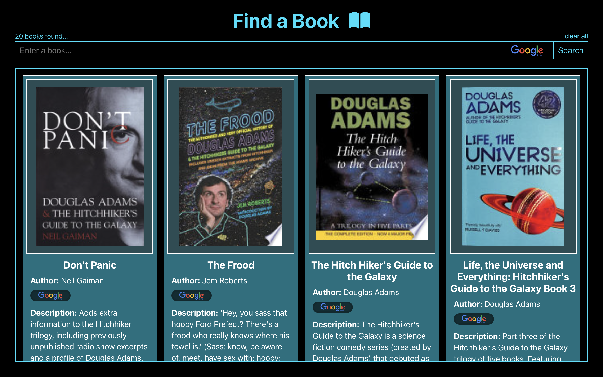

# Find a Book - Google Books API Search Engine

## Description

A simple React app that allows the user to search for books via the Google Books API and displays the results in a scrollable grid of books. For further details see the [Project Brief](#Project-Brief) below.

You can test the app here:

https://kris-martin.github.io/google-books/

## Todo

-   use onChange instead of document.getElementById for grabbing input string

## Future features to add:

-   When a user clicks a book in the grid, a modal should appear with more book information, think about full description, release, publish date, country, languages, etc.

## Project Brief

Create a page that allows users to search for books using the Google Books API.

### MVP:

-   Header section introducing the page
-   Form containing a text input and a submit / search button
-   A grid of books

### Instructions:

-   When the submit button is clicked request books from the Google books API using the input value as your query string
-   Give feedback to the user when no book results can be found for the query.
-   The books that you receive should be rendered in a books grid.
-   Each book in the grid should have an image, author, title and description
-   Each book should have a link to its external Google Books entry
-   Use a placeholder image for books without cover images
-   The grid should be responsive on different screen sizes
-   You should use async / await for your request code, NOT .then

### Styling (required):

-   Choose a colour palette
-   Styling must use BEM
-   Each block should have its own SCSS file
-   Your palette should use variables
